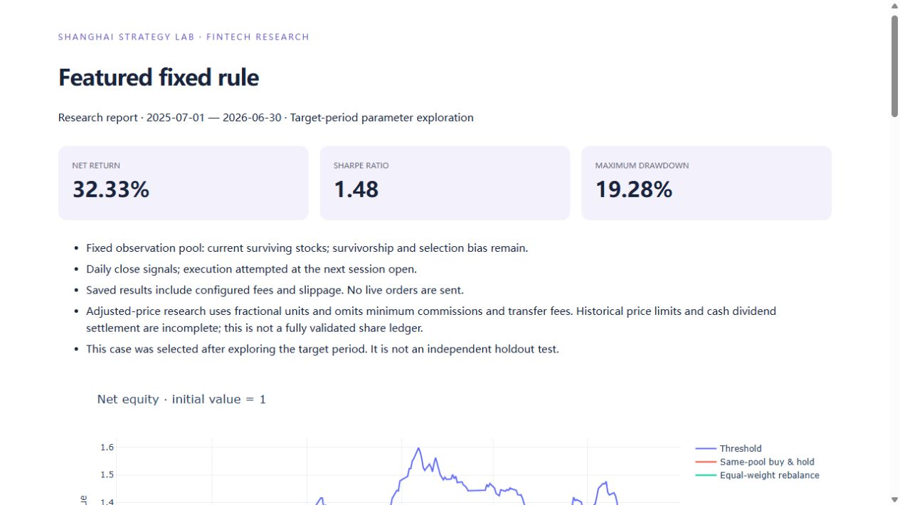
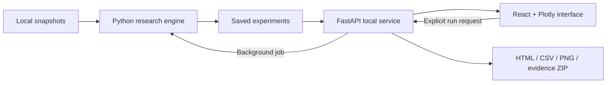

<div align="center">

# Shanghai A-Share Strategy Lab

### See the rule. Trace the trade. Understand the result.

An interactive FinTech research platform for explainable strategy backtesting.

**Python · React · TypeScript · FastAPI · Plotly**

[Quick start](#quick-start) · [Product tour](#product-tour) · [Research results](#research-results) · [中文操作手册](docs/USER_GUIDE_ZH.md)

</div>


**From a portfolio curve to the decision behind it.** Design a trading rule, inspect how a position was built, move through rolling research windows, and compare saved experiments in an English interface that runs locally.

The screenshots show a saved **100-stock historical research case**. The public source package includes a **synthetic-data demo generator**, not the historical market snapshot. Synthetic demo returns are not the research results below.

## Why this project

A backtest becomes more useful when its decisions can be inspected. This project connects financial rules to a product experience: editable parameters, linked charts, staged-entry explanations and portable research reports.

| Design goal | What you can do |
|---|---|
| Explain a simple rule | Change moving-average thresholds and inspect the resulting configuration |
| Build positions gradually | Allocate a position in 40% / 30% / 30% stages, with rechecks between purchases |
| Make research visible | Step through calibration, validation and replay windows |
| Trace an outcome | Click a month, open a fill, and inspect its signal, allocation plan and costs |
| Preserve experiments | Save new runs without overwriting earlier evidence; compare up to four compatible cases |
| Present anywhere | Use local snapshots and assets; export an English HTML report, trade CSV, evidence ZIP or PNG |

<a id="product-tour"></a>
## Product tour

### 1. Explore a rule

**Strategy Lab** supports threshold, trend-momentum, low-volatility, volume-breakout and short-term reversal rules. Edit entry conditions, staged allocations, execution costs and optional risk controls. An unsaved edit does not change the saved curve; running it creates a new experiment.

The featured rule is intentionally small:

```text
Close crosses above MA30 × 1.02 → create an entry plan
Next session                  → attempt the first 40% tranche
Wait and recheck strength      → attempt the next 30%, then 30%
Close falls below MA30 × 0.98  → cancel remaining purchases and attempt an exit next session
```

Targets allow up to ten stocks, with a 10% allocation cap per stock. A five-session waiting interval precedes a closing recheck; subsequent execution is attempted at the next open. This is not an unconditional purchase every five days.

### 2. Move through time


**Walk-Forward** uses a 12-month calibration window, a 3-month validation window and a 1-month replay window. Inspect the information cutoff, selected parameters and validation candidates for each month. Cash, holdings and unfinished plans carry into the next window on one continuous portfolio ledger.

### 3. Explain an actual execution


**Trade Replay** links monthly returns to individual fills. Filter by month or stock, then open a trade to inspect signal dates, prices, fees, slippage and closing holdings.

<details>
<summary><strong>Open the three-stage entry plan</strong></summary>


In the historical featured case, stock 600106 was accumulated on July 2, 11 and 23, 2025. The drawer separates the original allocation decision, later tranche checks, planned budgets and actual executions.

</details>

### 4. Compare and share


**Compare & Archive** places up to four compatible experiments on the same chart. Associated parameter searches retain unsuccessful and weaker attempts as well as selected results.

<details>
<summary><strong>Preview the exported English research report</strong></summary>



The HTML report embeds its chart resources for offline viewing. Reports and evidence exports apply to the active experiment; they do not automatically combine every checked comparison.

</details>

<a id="research-results"></a>
## Recorded research results

**Period:** July 2025–June 2026. **Universe:** 100 Shanghai main-board stocks. **Historical source:** a frozen BaoStock daily snapshot.

| Saved case | Annualized Sharpe | Maximum drawdown | Net return |
|---|---:|---:|---:|
| **Featured MA30 threshold** | **1.48** | **19.3%** | **32.3%** |
| Monthly walk-forward threshold | 1.30 | 13.7% | 23.6% |
| Original MA20 threshold | −0.76 | 20.2% | −11.2% |
| Original momentum rule | 1.01 | 13.8% | 18.4% |
| Featured rule + market trend filter | 1.70 | 10.7% | 27.8% |
| Featured rule + volatility allocation | 1.55 | 18.7% | 33.3% |

These are **retrospectively selected research results, not independent holdout evidence or live-trading returns**. The 1.48 result belongs to the fixed featured rule; the separate rolling case has Sharpe 1.30. The accepted featured case remains fixed even when a comparison has a higher score.

Sharpe uses the full sequence of daily net returns, 252-session annualization, sample standard deviation and a 0% risk-free rate. Drawdown uses the full equity path. A 25% evaluation limit is not a guaranteed loss cap.

The historical snapshot contains 84,300 rows from January 2023 through June 2026. Snapshot and experiment identifiers are recorded in [the showcase configuration](configs/showcase.json). The source package does not redistribute that snapshot or the historical run bundles; a new download need not reproduce the original observation pool.

<a id="quick-start"></a>
## Quick start

### Windows: run the public synthetic demo

Prerequisites: **Python 3.10** (the verified Windows environment) and **Node.js 22 with npm** for the frontend build. The Python project declares support for 3.10–3.12. First-time installation needs a connection; subsequent demo generation and local use do not require a paid API or key.

Extract or clone the project, then open PowerShell **inside the project root**:

```powershell
# 1. Create an isolated Python environment
py -3.10 -m venv .venv

# 2. Install the research dependencies
.\.venv\Scripts\python.exe -m pip install -r requirements-lock.txt

# 3. Install local web dependencies and build the frontend
powershell.exe -NoProfile -ExecutionPolicy Bypass -File .\setup-web.ps1

# 4. Generate a clearly labeled synthetic snapshot and saved experiment
.\.venv\Scripts\python.exe scripts/prepare_demo.py

# 5. Launch the application
& '.\Start Lab.cmd'
```

Open **http://127.0.0.1:8765** if the browser does not open automatically. Keep the service window running. Cancel any active computation before pressing **Ctrl+C** in that window to stop the service.

The launcher prefers the project's `.venv`, then the original prepared environment if present, then Python on PATH. To choose an interpreter or port explicitly:

```powershell
powershell.exe -NoProfile -ExecutionPolicy Bypass -File .\start.ps1 -PythonPath 'C:\path\to\python.exe' -Port 8766 -NoBrowser
```

**What the public demo contains:** 12 synthetic instruments, a synthetic market reference and one fixed-parameter experiment covering July 2025–June 2026. The seeded generator uses a weekday calendar, not an exchange calendar. Repeating the command creates another saved experiment. It does not replace `configs/showcase.json` or existing historical cases.

You can explore charts, inspect trades, edit rules and save another experiment. Rolling decisions appear only after a rolling experiment has actually been computed; a protocol preview is not a performance result. The fixed featured-reference card describes the historical case, not the synthetic run's metrics.

**Already have the prepared local project?** Keep its `storage` folder and launch directly. Do not generate synthetic data merely to view the original saved cases. Node.js is unnecessary once the frontend has been compiled.

### Other environments

The launchers target Windows. With a compatible Python environment and npm available, the underlying commands are:

```bash
python -m pip install -e '.[test]'
python -m pip install --target .runtime/python -r requirements-web-lock.txt
npm --prefix frontend ci --no-audit --no-fund
npm --prefix frontend run build
python scripts/prepare_demo.py
python scripts/serve.py --no-browser
```

The project includes CI configuration for Python checks on Windows/Linux and a frontend build. Local release verification is documented separately; a workflow file is not a claim that a new GitHub run has already passed.

## Using the app

| Page | First interaction to try |
|---|---|
| Overview | Hover the equity curve, then select a month in the return heatmap |
| Strategy Lab | Change Entry deviation and run a new fixed-parameter experiment |
| Walk-Forward | Open a recorded rolling run and move between months |
| Trade Replay | Open a buy and inspect its complete staged-entry plan |
| Compare & Archive | Select compatible runs, then export the active case |

Use **Saved experiment** to change the active run. On a prepared historical copy, **Featured case** restores the accepted historical case; it cannot load files absent from a source-only checkout. **Data & snapshots** is a read-only metadata panel, not an online downloader.

For the full page-by-page tutorial, startup troubleshooting, parameter units and export behavior, see the [Chinese user guide](docs/USER_GUIDE_ZH.md). The [three-minute recording plan](docs/VIDEO_RECORDING_PLAN_ZH.md) includes screenshots to show, exact historical run identifiers and English narration.

## Data and research assumptions

- **Free data first:** BaoStock supplied the recorded historical case; the project also has an AKShare adapter. New downloads require a connection. The included synthetic generator requires neither a connection nor credentials.
- **Local operation:** snapshots and results are stored under `storage/`. The default server and its workers block external connections; the browser uses local assets.
- **Next-session execution:** closing signals precede attempted execution at the next session open. Staging, cash, daily purchase budgets and trailing liquidity constrain fills.
- **Research accounting:** the featured case uses adjusted-price fractional units with proportional commission, sell-side stamp duty and slippage. Minimum commissions, transfer fees and full historical corporate-action/limit-price settlement are not modeled in that case.
- **Selection limits:** the historical observation pool uses surviving stocks, and the target period informed strategy selection. Monthly past-information selection does not remove this overall retrospective selection bias.

Download your own snapshot, if needed:

```powershell
.\.venv\Scripts\python.exe -m lab.cli download --source baostock --count 100 --start 2023-01-01 --end 2026-06-30
```

To use market-based risk controls with a downloaded snapshot, attach the market reference using `python -m lab.cli market <snapshot-path>` and use the **newly returned** snapshot path. For schema and coverage requirements, see the [data dictionary](docs/DATA_DICTIONARY.md).

## Architecture



| Location | Responsibility |
|---|---|
| `frontend/src/` | English interface, charts, trade explanations and comparison controls |
| `api/` | Local endpoints, task control, presentation and exports |
| `lab/` | Data validation, features, execution, rolling selection, risk and metrics |
| `configs/` | Strategy defaults and fixed historical showcase identifiers |
| `scripts/` | Launch, public demo preparation, evidence checks and packaging |
| `tests/` | Accounting, information timing, rolling selection and application checks |
| `docs/` | Screenshots, user guide, research assumptions and presentation material |

## Verification and known limits

```powershell
.\.venv\Scripts\python.exe -m pytest -q
npm.cmd --prefix frontend run build
```

The historical [verification record](docs/VALIDATION_V3.md) documents 41 tests, metric recomputation and an offline-copy reproduction. `scripts/verify_showcase.py` requires the original historical artifacts and is **not** a source-only smoke test. For the public release checks, see [GitHub release validation](docs/GITHUB_RELEASE_VALIDATION.md).

Current interface limits include a playback-speed selector whose timer remains approximately 1.5 seconds per step. Use month buttons or the slider for precise navigation. Trade CSV export includes the entire active experiment, regardless of table filters; comparison exports apply to the active experiment only.

The legacy Chinese Streamlit interface remains available through `start.ps1 -Legacy`; see its [separate guide](docs/README_LEGACY_ZH.md).

## Documentation and publishing

- [完整中文操作手册](docs/USER_GUIDE_ZH.md)
- [Three-minute demo narration](docs/DEMO_EN.md)
- [录屏分镜与英文旁白](docs/VIDEO_RECORDING_PLAN_ZH.md)
- [GitHub 项目简介、Topics 与上传步骤](docs/GITHUB_PUBLISHING_ZH.md)
- [Data dictionary](docs/DATA_DICTIONARY.md) · [Fee review](docs/FEE_REVIEW_2026.md)
- [Contributing](CONTRIBUTING.md)

## License

Code is available under the [MIT License](LICENSE). The software license does not grant rights to third-party market data. Public sample generation is explicitly synthetic; local historical snapshots and private execution artifacts are excluded from the source package.
