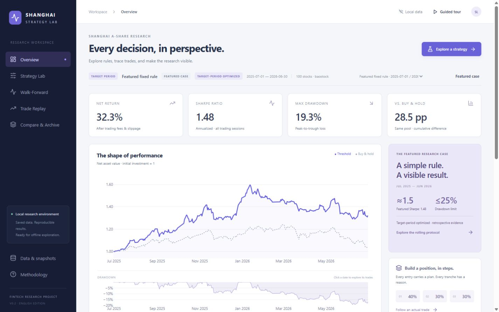
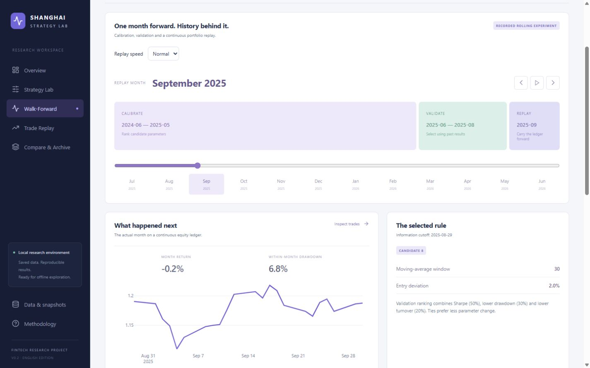
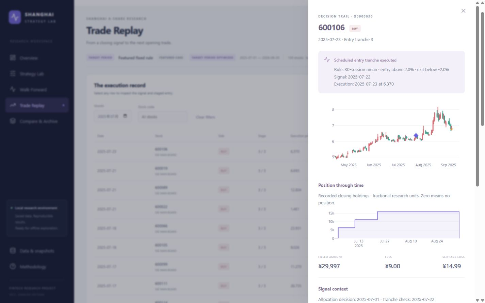
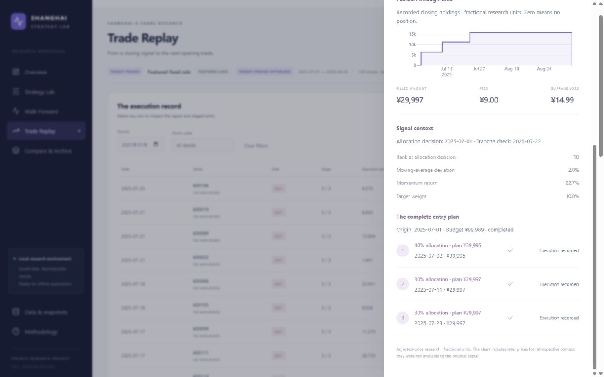
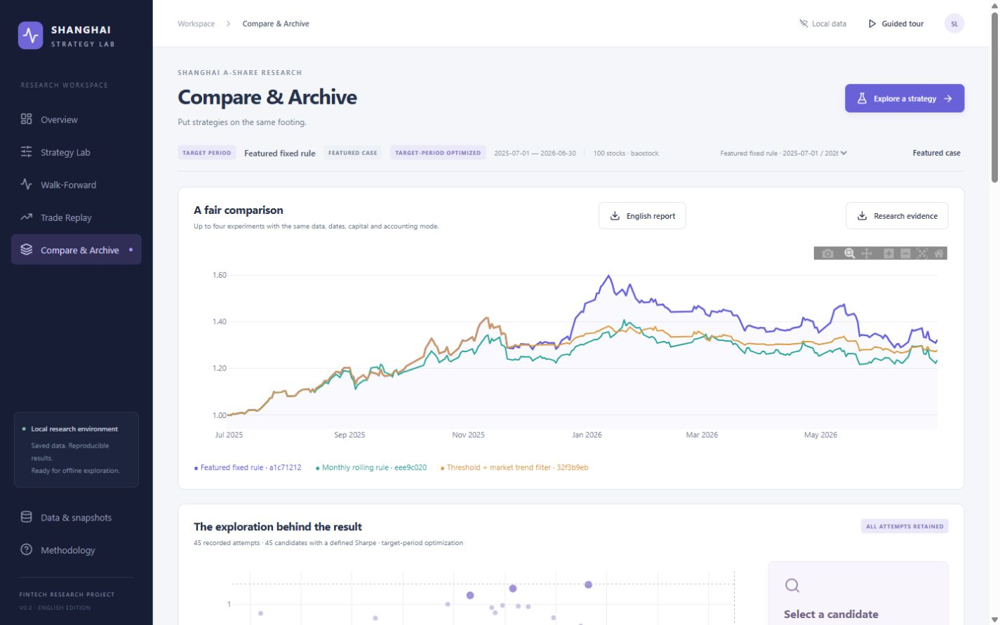

# Shanghai A-Share Strategy Lab — 中文完整操作手册

一个面向金融科技项目展示的上海 A 股策略研究平台：用简单、可修改的交易规则生成回测结果，通过英文网页展示净值、滚动窗口、分批建仓、交易解释和实验对比。

**本 README 是中文使用手册；网页及导出的研究报告使用英语。** 以下说明对应当前英文版 V0.2，文档核对日期为 **2026-09-19**。

当前精选案例覆盖 **2025-07-01 至 2026-06-30**：**Sharpe 1.48，最大回撤 19.3%，净收益 32.3%**。可以表述为“Sharpe approximately 1.5”，不能写成“Sharpe > 1.5”。这是查看目标期间结果后选定的回顾性研究案例，不是独立留出测试。精选案例由配置文件固定，新建实验不会替换它。



[返回英文项目首页](../README.md) · 本手册保留本机完整案例的操作说明；公开源码的首次运行请优先按英文首页准备合成演示。

## 目录

- [1. 最快启动：当前电脑](#quick-start)
- [2. 启动参数、关闭与重启](#launch-options)
- [3. 新电脑、源码与离线包](#installation)
- [4. 网页导航与通用操作](#navigation)
- [5. Overview：理解结果](#overview)
- [6. Strategy Lab：修改规则并运行](#strategy-lab)
- [7. Walk-Forward：滚动窗口与回放](#walk-forward)
- [8. Trade Replay：交易、信号与分批建仓](#trade-replay)
- [9. Compare & Archive：对比与导出](#compare)
- [10. 一次完整的演示操作](#demo)
- [11. 数据、免费接口与离线使用](#data)
- [12. 指标、精选结果与研究边界](#method)
- [13. 文件保存位置与备份](#files)
- [14. 常见问题](#faq)
- [15. 开发、复核与旧版界面](#maintenance)

<a id="quick-start"></a>
## 1. 最快启动：当前电脑

适用于已经准备好依赖、数据和前端的当前项目目录 `D:\project2_backtest`。

1. 在资源管理器中进入 `D:\project2_backtest`。
2. 双击 **`Start Lab.cmd`**。
3. 等待浏览器打开 **http://127.0.0.1:8765**。
4. 保持启动窗口开启，在网页中操作。

如果浏览器没有自动打开，手动输入上面的地址即可。不要直接双击 `frontend/dist/index.html`，网页需要本地服务提供实验和交易数据。

正常情况下，首页会加载已保存的精选案例，无须下载数据，也无须先运行一次回测。首页核心数值应为：

| 项目 | 预期内容 |
|---|---|
| 当前案例 | Featured fixed rule |
| 期间 | July 2025 – June 2026 |
| NET RETURN | 32.3% |
| SHARPE RATIO | 1.48 |
| MAX DRAWDOWN | 19.3% |

如果此前切换了实验，点击 **Featured case** 恢复。只点击左侧 **Overview** 会返回当前实验的首页，不会自动切回精选案例。

**当前准备好的版本，浏览、回放和本地计算均不需要付费 API、订阅或联网。** 如果搬到新电脑，请先阅读第 3 节；离线包不包含 Python 本身。

<a id="launch-options"></a>
## 2. 启动参数、关闭与重启

### 2.1 在 PowerShell 中启动

```powershell
Set-Location -LiteralPath 'D:\project2_backtest'
.\start.ps1
```

启动脚本优先使用项目 `.venv/Scripts/python.exe`，其次使用原准备环境 `D:/anaconda/envs/FinRL/python.exe`，最后尝试 PATH 中的 `python`。显式传入的解释器不存在时会报错；选中的环境必须装有项目依赖。

常用启动选项如下，每行是一个独立示例，不必全部执行：

```powershell
# 只启动服务，不自动打开浏览器
.\start.ps1 -NoBrowser

# 使用另一个端口，然后访问 http://127.0.0.1:8766
.\start.ps1 -Port 8766

# 明确指定已准备好的 Python 环境
.\start.ps1 -PythonPath 'D:\anaconda\envs\FinRL\python.exe'

# 同时指定解释器、端口和不自动打开浏览器
.\start.ps1 -PythonPath 'D:\anaconda\envs\FinRL\python.exe' -Port 8766 -NoBrowser
```

脚本会切换到项目目录，所以从别处调用 `start.ps1` 也能定位项目文件。下文直接运行 Python 的命令则都以项目根目录为工作目录。

### 2.2 关闭与重启

1. 如果正在计算，先点击网页任务提示中的 **Cancel**，等待任务停止。
2. 在真正运行服务的启动窗口中按 **Ctrl+C**。
3. 再次双击 `Start Lab.cmd` 即可重启。

关闭浏览器标签页不会停止服务。不要在计算过程中直接关闭服务窗口并假设后台计算一定随之结束；计算任务由独立工作进程执行。

重复启动时，如果同一端口已存在本应用的服务，启动器会复用它，而不是创建第二个服务。新启动的窗口可能很快结束，原服务窗口仍负责运行。

**同时打开两份项目副本时，请使用不同端口。** 当前服务识别只检查应用标识，不比较项目所在目录；同端口可能打开另一份副本的已有服务。

### 2.3 检查服务是否正常

浏览器打开 `http://127.0.0.1:8765/api/health`，或在 PowerShell 执行：

```powershell
Invoke-RestMethod 'http://127.0.0.1:8765/api/health'
```

默认启动应看到 `status: ok`、`app: shanghai-strategy-lab` 和 `offline: true`。这里的 `offline` 表示应用启用了外部网络访问限制，不表示 Windows 网卡已关闭。

<a id="installation"></a>
## 3. 新电脑、源码与离线包

### 3.1 先判断你拿到哪种版本

| 情况 | 需要做什么 |
|---|---|
| 当前已准备好的项目 | 直接双击启动，无须安装或构建 |
| 完整离线交付包 + 已准备好的 Python 数值环境 | 解压到可写目录，指定该 Python 后启动 |
| 完整离线包 + 全新电脑 | 先准备兼容的 Python 和数值依赖，再离线演示 |
| 仅源码 | 安装依赖、构建前端，并恢复数据快照和保存的实验 |

项目支持 Python **3.10–3.12**；现有 Windows 依赖锁文件的验证环境为 **Python 3.10**。需要从源码构建前端时，还需要可用的 Node.js/npm。

**Node.js 只用于构建前端；已有 `frontend/dist` 的编译版启动不需要 Node.js。**

### 3.2 新电脑首次准备：联网执行一次

建议创建独立环境，避免更改已有金融研究环境中的依赖。下面假设电脑已安装 Python 3.10、Windows Python 启动器 `py` 和 Node.js/npm：

```powershell
Set-Location -LiteralPath 'D:\project2_backtest'

# 创建项目自己的 Python 环境
py -3.10 -m venv .venv

# 安装研究引擎及相关依赖
.\.venv\Scripts\python.exe -m pip install -r requirements-lock.txt

# 安装独立的网页服务依赖，并构建网页
.\setup-web.ps1 -PythonPath 'D:\project2_backtest\.venv\Scripts\python.exe'

# 使用这个环境启动
.\start.ps1 -PythonPath 'D:\project2_backtest\.venv\Scripts\python.exe'
```

如果项目放在其他位置，请替换示例中的绝对路径。如果系统没有 `py` 命令，可以用已安装 Python 的完整路径执行 `-m venv .venv`。

启动器会优先发现项目的 `.venv`，因此按上述步骤完成准备后可以双击启动。使用其他位置的解释器时，继续通过 `-PythonPath` 指定。

`setup-web.ps1` 会完成两件事：

- 将网页服务依赖安装到项目的 `.runtime/python`，使用 `requirements-web-lock.txt`。
- 在 `frontend` 下安装锁定的前端依赖并生成 `frontend/dist`。

该脚本不会替你安装 Python，也不会准备股票数据。它同样优先使用项目 `.venv`；其他环境可通过 `-PythonPath` 指定。已有兼容数值环境时，可以跳过创建环境和安装数值依赖，仅执行网页准备步骤。

**执行完上述步骤后，确认 `storage/snapshots` 和 `storage/runs` 中有数据。** 源码仓库默认不包含这些大文件，仅安装软件不会自动出现精选结果。

### 3.3 离线交付包含什么

现有交付文件为 `storage/Shanghai_Strategy_Lab_Offline.zip`。解压后的完整交付包含选定的数据快照、实验结果、网页编译文件、网页服务依赖和项目代码。

它不包含 Python 解释器及完整的 Python 数值环境。因此，“离线展示”是指**环境准备完成后**，浏览和计算不依赖网络；不是在一台没有 Python 的电脑上直接运行一个独立 EXE。

建议在展示前完成一次以下检查：

1. 将项目完整解压到本地可写目录，不要在 ZIP 内直接运行。
2. 用指定解释器启动，确认精选结果正常加载。
3. 打开交易详情并导出一次英文报告。
4. 断开网络后再次启动并重复浏览。

如果只需要给他人看研究结果，可直接分享已导出的英文 HTML 报告；它不需要运行本地服务器，但也不包含完整应用的调参、回测和导航功能。

<a id="navigation"></a>
## 4. 网页导航与通用操作

建议在桌面浏览器中演示，窗口宽度至少约 1280 像素；1440 × 900 更方便同时查看图表与说明。较窄窗口下部分导航会以图标显示，可滚动查看页面内容。

| 网页入口 | 用途 |
|---|---|
| **Overview** | 查看当前实验的总体表现、月度收益和仓位 |
| **Strategy Lab** | 修改策略、建仓方式、风险控制和执行参数，运行新实验 |
| **Walk-Forward** | 查看按月移动的研究窗口、选参依据和连续组合结果 |
| **Trade Replay** | 按月份或股票查看成交，并追溯信号与建仓计划 |
| **Compare & Archive** | 比较保存的实验、查看搜索记录并导出 |
| **Saved experiment** | 切换当前活动实验 |
| **Featured case** | 恢复固定的精选案例并返回 Overview |
| **Explore a strategy** | 进入 Strategy Lab |
| **Guided tour** | 打开五步引导，通过 Back / Next step / Finish tour 浏览 |
| **Data & snapshots** | 查看本地快照来源、期间、股票数及覆盖情况 |
| **Methodology / View assumptions** | 查看研究模式、成本、数据与实验标识等假设 |

### 当前实验与未保存参数

多数图表、交易记录和导出都围绕 **Saved experiment** 所选的当前实验工作。切换实验会载入其配置，并清除交易月份筛选和已打开的交易详情；未运行的参数修改不会成为新实验。

**进入 Walk-Forward 可能自动切换当前实验。** 如果当前实验没有滚动窗口记录，页面会尝试载入预先配置的滚动案例；因此再返回 Overview 时看到的可能是滚动案例的 Sharpe 1.30。要恢复 1.48，请点击 **Featured case**。

浏览器刷新会重新加载初始状态，通常回到精选案例。已保存实验仍在磁盘上，但未运行的参数草稿、临时对比和页面选择不应视为已保存。刷新后应用会尝试重新获取仍在运行的任务状态。

右侧详情抽屉可通过关闭按钮、点击遮罩或按 **Esc** 关闭。图表可悬停查看数值，支持的图表可拖动缩放、使用工具栏或双击恢复视图。

<a id="overview"></a>
## 5. Overview：理解结果

### 5.1 顶部指标

| 英文指标 | 含义 |
|---|---|
| NET RETURN | 整个所选期间的净收益，已反映所配置的交易成本 |
| SHARPE RATIO | 根据整个期间每日净收益计算的年化夏普比率 |
| MAX DRAWDOWN | 整条组合净值路径从前期高点到后续低点的最大损失 |
| VS. BUY & HOLD | 策略与同股票池买入并持有基准的累计收益差，单位为百分点 |

`VS. BUY & HOLD` 不是收益倍数，也不是年化超额收益。最大回撤在界面中显示正的损失幅度；底层记录可能以负值保存。

### 5.2 净值和回撤图

**The shape of performance** 将初始投资归一化为 1。主图展示当前策略和同股票池买入并持有基准。

- 悬停查看某一天的净值。
- 点击主净值曲线上的日期点，进入该月的 **Trade Replay**。
- 下方回撤图用于观察和缩放回撤路径；当前版本没有绑定点击跳转月份的交互。

右侧 **THE FEATURED RESEARCH CASE** 卡片始终介绍固定精选案例的 1.48，即使当前活动实验已切换；实际活动实验的表现应看顶部指标和图表。

### 5.3 月度收益与仓位

**Monthly returns** 中点击有效月份格子，即可查看该月成交。空白月份表示没有对应数据，不能据此解释为收益为零。格子内是四舍五入后的简写数值，可悬停查看更多精度。

仓位图对比实际已投资比例与收盘决策产生的目标比例。点击日期点可以查看当日目标仓位、趋势条件和市场波动率等信息。目标仓位不会立即等于实际仓位：分批买入、下一交易日执行、成交约束和价格变化都会产生差异。

**Different rules. Same lens.** 展示各策略已有的保存案例。点击可载入该实验，但这些快捷入口不保证具有相同研究日期；正式对比请使用 Compare & Archive 并检查条件。

<a id="strategy-lab"></a>
## 6. Strategy Lab：修改规则并运行

推荐从 **Featured case → Strategy Lab** 开始，这样初始草稿来自已接受的 MA30 阈值策略。

### 6.1 先选择 Research mode

| 选项 | 实际行为 | 运行按钮 |
|---|---|---|
| Fixed parameters | 用当前配置完成一次固定参数回测并保存新实验 | Run & save experiment |
| Monthly walk-forward | 使用当前策略家族的候选参数网格，按月校准、验证、选择并执行 | Run rolling experiment |
| Target-period exploration | 检查五类策略的 45 个预设配置，记录全部尝试并保存前三名的完整结果 | Explore 45 candidates |

选择后两种模式时，界面会将研究日期设为 **2025-07-01 至 2026-06-30**，并尝试选择覆盖目标期间的至少 100 股快照。切回 Fixed parameters 后，请再次检查日期和快照。

滚动实验使用候选网格，部分参数会由网格决定，不能理解成“将当前每个滑块值原封不动逐月回测”。目标期间搜索覆盖五类策略，也不只搜索当前下拉框选中的一类。

普通演示可以直接查看已有搜索和滚动记录，不需要每次重新计算全部候选。

### 6.2 策略参数

| 策略家族 | 主要控件 | 阅读方式 |
|---|---|---|
| Threshold（均线阈值） | Moving-average window、Entry deviation、Exit deviation | 收盘价格相对均线的偏离触发买卖 |
| Trend momentum（趋势动量） | Momentum lookback、Short moving average、Long moving average | 根据历史动量和趋势条件筛选 |
| Low volatility（低波动） | Volatility lookback | 根据指定历史窗口的波动率筛选 |
| Volume breakout（放量突破） | Breakout lookback、Trading amount multiple | 观察价格突破与成交额放大 |
| Short-term reversal（短期反转） | Reversal lookback、Trend moving average | 结合短期价格变化与趋势条件筛选 |

精选阈值策略的核心设置如下：

| 参数 | 数值 | 含义 |
|---|---:|---|
| Moving-average window | 30 | 使用过去 30 个交易时段的均线 |
| Entry deviation | +2% | 收盘价格向上穿越相对均线 +2% 的阈值时产生入场信号 |
| Exit deviation | -2% | 收盘偏离低于 -2% 时产生离场信号 |
| Positions | 10 | 最多持有的目标股票数 |
| Maximum stock weight (%) | 10 | 单只股票的目标权重上限 |

偏离率可理解为 `收盘价 / 移动平均价 - 1`。首次入场使用“穿越”条件，不是每一天高于阈值都重复创建第一批买单。信号产生于收盘后，交易尝试发生在下一交易时段。

### 6.3 Staged entry：分批建仓

勾选 **Staged entry** 后，可以修改三批比例和 **Gap between tranches (sessions)**。三批比例必须均为正数，合计为 **100%**；例如 `40 / 30 / 30` 或 `50 / 30 / 20`。

精选设置为 **40% / 30% / 30%，间隔 5 个交易时段**。比例分配的是这只股票的一次建仓计划预算，不是整个组合的资金。

例如，某股票的建仓计划预算是 ¥100,000，则计划三批金额是 ¥40,000、¥30,000、¥30,000。实际成交金额还会受到执行与资金约束影响。

操作和执行过程是：

1. 收盘检查信号，创建该股票的目标预算和建仓计划。
2. 下一交易时段尝试第一批成交。
3. 成交后等待规定的交易时段，再在收盘重新检查后续批次条件。
4. 条件满足后，在下一交易时段尝试下一批。

因此，间隔设为 5 不表示“每隔 5 个自然日自动买入”，也不保证两次实际成交恰好相隔 5 个交易日。条件失效、成交限制、计划到期等都可能造成延后或不再成交。

关闭 Staged entry 表示使用单批入场方式。原有精选实验仍保留；只有运行后才生成使用新方式的实验。

### 6.4 风险控制开关

- **Market trend filter**：根据市场趋势调整目标总仓位；默认参考市场 60 日均线，弱趋势下目标比例降至防御水平 25%。
- **Volatility-based allocation**：根据过去 20 个市场交易日的年化波动率缩放仓位，默认目标波动率 15%，缩放比例不超过 1。

两个开关可以组合。网页提供启用/停用操作，底层的市场均线长度、防御比例和目标波动率等并没有全部做成网页输入框。

这里的“弱趋势下 25% 目标仓位”和项目“最大回撤评估上限 25%”是两个不同概念。开关不会保证将实际回撤锁死在某个数值。

### 6.5 Data, dates & execution

展开该区域可调整：

| 控件 | 操作说明 |
|---|---|
| Local snapshot | 选择已存在的本地数据快照 |
| Start / End | 设置回测起止日期，数据还应包含指标预热所需的此前历史 |
| Positions | 设置目标持股数量上限 |
| Maximum stock weight (%) | 输入百分数，例如 10 表示 10% |
| Commission (basis points) | 佣金基点；1 bp = 0.01%，3 bps = 0.03% |
| Slippage (basis points) | 滑点基点；5 bps = 0.05%，反映在执行价格中 |

当前网页没有初始资金、无风险利率、严格实际股数模式或滚动窗口长度的完整编辑面板。这些设置可在保存的配置和方法说明中核对，不要把它们理解成已经提供的网页功能。

### 6.6 运行、取消与查看新结果

1. 调整参数后，页面提示 **Parameters changed — run to update.**
2. 此时右侧仍是已保存结果，曲线不会因为拖动滑块自动改变。
3. 点击对应运行按钮，等待任务完成。运行期间可继续查看保存的结果。
4. 完成后页面载入新实验，并在有前一个结果时显示 **Before & after**。
5. 紫色是新结果，青绿色是上一个保存结果。点击月度收益可继续追踪新实验的成交。

每次计算会生成新的实验编号，不覆盖精选记录。日期不同时，Before & after 会提醒期间不同；即使日期相同，也应核对其他修改过的条件。

同一服务一次只允许一个计算任务。需要停止时使用 **Cancel**；看到失败信息时先保存错误内容并查看启动窗口，不要连续重复提交任务。

<a id="walk-forward"></a>
## 7. Walk-Forward：滚动窗口与回放



### 7.1 默认研究协议

已有滚动案例使用 **12 个月校准 + 3 个月验证 + 1 个月向前执行**，每月移动一次，最终保持同一个连续组合账本。

以 2025 年 7 月为例：

| 阶段 | 时间 | 作用 |
|---|---|---|
| CALIBRATE | 2024-04 至 2025-03 | 对候选参数进行历史筛选 |
| VALIDATE | 2025-04 至 2025-06 | 使用后续但仍早于执行月的数据选择候选 |
| Information cutoff | 2025-06-30 | 当月决策可使用的信息截止日 |
| REPLAY | 2025-07 | 执行所选规则，并承接已有现金、持仓和计划 |

到 2025 年 8 月，三个窗口整体向前移动一个月。不会每月重置为一笔全新资金，再将月度结果简单拼接。

当前记录的校准候选为 9 个，验证短名单最多 5 个。验证排名综合 Sharpe、较低回撤和较低换手率，权重分别为 **50% / 30% / 20%**，并应用 **25%** 的验证回撤限制。没有合格候选时产生现金目标；实际降仓仍受执行条件约束。

### 7.2 页面操作

1. 点击月份按钮或拖动月份滑块，选择 Jul 2025 至 Jun 2026 中的一个月。
2. 使用左右箭头逐月切换。
3. 点击播放按钮自动前进，再点击暂停；到最后一个月停止，从末月再次播放会从首月开始。
4. 查看 **The selected rule** 中的候选、参数和信息截止日。
5. 查看 **Why this candidate?**，比较验证 Sharpe、回撤、换手率、成交数和选择得分。
6. 查看 **The full calibration field**，了解未进入短名单的其他候选。
7. 点击 **Inspect trades**，进入该滚动实验、该月份的成交记录。

**当前已知限制：** 页面有 Replay speed 的 Slow / Normal / Fast 下拉框，但当前播放计时仍固定为约 **1.5 秒一步**，切换选项不会改变实际速度。逐月按钮、滑块及播放/暂停可用于演示。

### 7.3 如何读结果

- **MONTH RETURN** 是所选月实际收益。
- **WITHIN-MONTH DRAWDOWN** 是所选月内部回撤，不等于全年最大回撤。
- 月内图保留连续净值，不是每个月都从 1 开始。
- **RECORDED ROLLING EXPERIMENT** 表示存在实际保存的窗口决策。
- **PROTOCOL PREVIEW / Window results have not been computed** 表示当前所选实验没有真实滚动记录；时间轴只是协议示意，不能将其当作已计算的结果。

滚动方法保证每个记录窗口按此前信息选择候选，但项目整体仍包含查看目标期间后做研究选择的过程。不能仅凭使用滚动窗口就将整个精选项目称为未经查看的独立样本外验证。

<a id="trade-replay"></a>
## 8. Trade Replay：交易、信号与分批建仓



### 8.1 筛选成交

| 控件 | 用法 |
|---|---|
| Month | 选择一个月份；清空后显示全部月份 |
| Stock code | 输入完整的六位股票代码，例如 600106；清空后显示全部股票 |
| Clear filters | 清除月份和股票筛选 |
| 左右翻页按钮 | 每页最多 50 笔成交 |
| Export trades | 下载当前实验的全部成交 CSV |

**Export trades 不会只导出当前筛选的月份、股票或当前页。** 如果只需要筛选后的子集，可下载完整 CSV 后自行筛选。

表中的 `trades` 是成交记录数，不等于已完成的一买一卖交易轮次数。`Stage` 的 `1 / 3`、`2 / 3`、`3 / 3` 表示入场批次，`Exit` 表示卖出或减仓。

### 8.2 打开一笔交易

点击任意成交行，或在该行获得键盘焦点后按 **Enter**，右侧会打开详情：

- **Signal / Execution**：区分收盘信号日期与实际成交日期、价格。
- **价格图**：红色 K 线表示上涨，绿色表示下跌；上三角是实际买入，下三角是实际卖出，菱形标记所选成交。
- **Position through time**：显示该股票记录的收盘持仓数量；研究模式允许小数单位。
- **FILLED AMOUNT / FEES / SLIPPAGE LOSS**：成交额、费用和价格滑点影响。
- **Signal context**：建仓决策日期、该批次重检日期，以及对应指标。
- **The complete entry plan**：完整预算、每批计划比例和已记录的成交日期、金额。
- **Unfilled attempts**：若存在被拒绝的交易尝试，会显示原因。

`Rank at allocation decision` 是最初配置预算时的排名，不一定是后续某一批成交前的实时排名。详情中展示的后续价格用于回顾解释，不表示策略当时能够看到未来价格。

### 8.3 可直接照着演示的分批建仓例子

1. 点击 **Featured case**。
2. 进入 **Trade Replay**。
3. 将 Month 设为 **2025-07**，Stock code 输入 **600106**。
4. 点击 **2025-07-23** 的买入记录。
5. 查看三批建仓计划和实际成交。

该保存案例的一次计划预算约为 **¥99,989**：

| 批次 | 计划比例 | 记录的成交日期 | 成交额约值 |
|---|---:|---|---:|
| 第一批 | 40% | 2025-07-02 | ¥39,995 |
| 第二批 | 30% | 2025-07-11 | ¥29,997 |
| 第三批 | 30% | 2025-07-23 | ¥29,997 |

最初预算决策日期是 2025-07-01，第三批重检发生在 2025-07-22，第三批实际执行价格约为 6.370。这能直接说明为什么“有建仓计划”不等于“当天一次性买满”。



某一批显示 **No recorded fill for this stage** 时，应结合计划状态和失败尝试理解；它既不表示已经成交，也不保证以后必定成交。

<a id="compare"></a>
## 9. Compare & Archive：对比与导出



### 9.1 比较已有实验

1. 先选择希望作为当前活动实验的案例。
2. 进入 **Compare & Archive**。
3. 在 **Research archive** 的 Compare 列勾选其他实验，最多同时显示 **4 个**。
4. 对照曲线、图例、研究期间以及表格中的收益、Sharpe 和回撤。
5. 点击某行 **Open** 可将该实验载入为当前活动实验。

可比较条件会检查快照、日期、初始资金、记账模式及配置的佣金、最低佣金、滑点和成交参与率等。条件不同或已选满四个时，其他选框会禁用。

这不表示所有实验的策略规则、分批参数或调仓方式完全一致；这些差异正是比较对象的一部分，解释结果时仍需核对配置。

点击 Open 后，当前实验改变，对比选择也会重新初始化。点击对比净值曲线的日期会打开**当前活动实验**该月的成交，不会根据点击了哪条曲线自动切换实验。

### 9.2 查看参数探索记录

与搜索记录关联的实验会显示 **The exploration behind the result**：

- 散点图横轴为回撤、纵轴为 Sharpe，并标出 25% 与 1.5 的参考位置。
- 点击一个点可查看该候选参数与结果。
- 只有保存了完整实验的候选才提供 **Open saved case**。
- 45 次尝试都有记录，但失败或无法计算 Sharpe 的尝试不会成为正常散点。

当前目标期间搜索只为前三名保存完整交易明细；其余候选的搜索指标不等于拥有完整的成交回放记录。

### 9.3 四种导出分别包含什么

**所有导出都针对当前活动实验。** 勾选四条对比曲线不会让这些按钮自动生成“四个实验合并报告”。导出前先核对 Saved experiment，必要时使用 Open 切换。

| 按钮 | 文件 | 内容与边界 |
|---|---|---|
| English report | HTML | 英文研究报告，包含图表、指标、配置、来源及可用的滚动/搜索记录；图表资源内嵌，可离线打开 |
| Research evidence | ZIP | 当前实验结果文件、英文报告、成交 CSV 及关联搜索记录；不包含完整应用、Python 环境或原始数据快照 |
| Equity PNG | PNG | 当前实验净值、同股票池基准、回撤与核心指标组成的静态图，适合演示材料 |
| Export trades | CSV | 当前实验全部成交；入口位于 Trade Replay |

文件通常进入浏览器默认下载目录，也可能弹出保存位置选择，具体取决于浏览器设置。Research evidence 不应理解成完整离线交付包，也不保证包含单独导出的 Equity PNG。

图表工具栏还可能提供相机按钮，但浏览器对其下载的处理不一致。需要稳定导出图像时优先使用 **Equity PNG**。

<a id="demo"></a>
## 10. 一次完整的演示操作

以下流程可以作为首次使用教程，也可缩短成面试演示。

1. **启动**：双击 Start Lab.cmd，确认首页加载。
2. **固定案例**：点击 Featured case，说明研究期间、Sharpe 1.48 和 19.3% 回撤。
3. **看结果路径**：悬停净值图，点击 Monthly returns 中一个月份，展示结果可以追溯到实际成交。
4. **解释一次决策**：按第 8 节筛选 600106 的 2025 年 7 月记录，打开第三批买入，展示 40/30/30 的计划和实际执行。
5. **说明滚动研究**：进入 Walk-Forward，选择 July 2025，解释 12+3+1 的时间边界。
6. **看选参依据**：前进一个月，展示截止日期、候选验证指标和最终选择；不要将时间轴示意当作结果。
7. **恢复精选配置**：点击 Featured case，再进入 Strategy Lab，选择 Fixed parameters。
8. **做一个小实验**：例如将 Entry deviation 从 2.0% 调到 2.5%，其余条件保持一致，点击 Run & save experiment。新结果无需优于原策略，重点展示规则、结果和交易解释的联系。
9. **对比与导出**：进入 Compare & Archive，比较兼容实验；先选中想导出的活动实验，再下载 English report 和 Equity PNG。
10. **结束**：点击 Featured case 恢复展示状态，确认无计算任务后在服务窗口按 Ctrl+C。

若演示时间只有三分钟，可使用 [英文三分钟讲稿](../docs/DEMO_EN.md)，以已有记录演示，省去现场计算的等待。应用内 Guided tour 也能依次介绍五个页面。

<a id="data"></a>
## 11. 数据、免费接口与离线使用

### 11.1 是否需要买 API

**复现和演示当前案例不需要购买 API，也不需要填写 API key。** 已保存数据来自免费 BaoStock 路径，项目还包含 AKShare 数据适配能力；当前展示并不依赖另一个收费订阅平台。

接口服务可用性与当前文件能否离线使用是两回事：首次下载或更新数据需要联网，已保存快照的浏览与计算不需要联网。免费来源连接失败时，仍可以使用现有快照完成展示。

| 当前精选快照 | 内容 |
|---|---|
| 快照 ID | `ca9ede9480e8711d` |
| 来源 | BaoStock |
| 股票池 | 100 只上海主板股票 |
| 历史期间 | 2023-01-03 至 2026-06-30 |
| 行数 | 84,300 |
| 每只股票交易时段数 | 843 |

2023 年开始的历史用于指标预热和滚动窗口，首页的精选评估期间仍是 2025 年 7 月至 2026 年 6 月。

### 11.2 网页可以下载新数据吗

当前英文界面中的 **Data & snapshots 是只读信息面板**，没有在线下载或 CSV 上传按钮。新数据可通过命令行准备；旧版中文界面保留其数据操作流程，参见 [旧版使用手册](../docs/README_LEGACY_ZH.md)。

### 11.3 可选：下载新的免费数据

以下命令是**联网维护操作**，不是启动或离线展示的必要步骤。运行前切换到项目根目录，并根据实际环境替换 Python 路径。

```powershell
Set-Location -LiteralPath 'D:\project2_backtest'

# 查看命令说明
& 'D:\anaconda\envs\FinRL\python.exe' -m lab.cli --help

# 下载新的 100 股快照
& 'D:\anaconda\envs\FinRL\python.exe' -m lab.cli download --source baostock --count 100 --start 2023-01-01 --end 2026-06-30
```

下载完成后会输出快照路径。`--count 100` 按当前股票池选择股票，不保证与原冻结快照的 100 只股票完全一致；严格复现应继续使用原快照。

若新快照还需要市场趋势或市场波动率数据，可将上一步输出的实际快照路径传给 market 子命令：

```powershell
# 将 NEW_SNAPSHOT_ID 替换为刚下载完成的真实 ID
& 'D:\anaconda\envs\FinRL\python.exe' -m lab.cli market 'storage/snapshots/NEW_SNAPSHOT_ID'
```

补充市场数据会保存新的快照并输出新路径。后续实验应使用补充后的新快照，而不是继续选原先缺少市场数据的版本。回到网页刷新后，在 Local snapshot 中核对来源、股票数和结束日期。

不要为了“更新数据”覆盖原精选快照或修改旧实验结果。新快照和新实验分别保存，才能解释每个结果所使用的数据版本。

### 11.4 离线模式范围

默认服务及计算进程限制外部网络连接，前端使用本地资源，不要求 CDN、账户登录或云端数据库。该设置不修改电脑整体网络配置，也不阻止你在另外的维护终端中主动下载新数据。

数据字段、复权价格和元数据要求参见 [数据字典](../docs/DATA_DICTIONARY.md)。

<a id="method"></a>
## 12. 指标、精选结果与研究边界

### 12.1 已保存的主要案例

下表为当前已保存结果的显示精度，不是未来运行结果的保证。这些案例共享数据、目标期间、资金、记账模式和配置成本。

| 案例 | Sharpe | 最大回撤 | 净收益 |
|---|---:|---:|---:|
| **精选 MA30 阈值策略** | **1.48** | **19.3%** | **32.3%** |
| 按月滚动阈值策略 | 1.30 | 13.7% | 23.6% |
| 原 MA20 阈值策略 | -0.76 | 20.2% | -11.2% |
| 原动量规则 | 1.01 | 13.8% | 18.4% |
| 精选规则 + 市场趋势过滤 | 1.70 | 10.7% | 27.8% |
| 精选规则 + 波动率仓位控制 | 1.55 | 18.7% | 33.3% |

风险控制变体是声明过的比较实验，不自动替换已经接受的 1.48 精选案例。完整实验标识和展示映射保存在 [configs/showcase.json](../configs/showcase.json)。

### 12.2 指标口径

- 净收益来自最终组合账本，反映已计入的成本。
- Sharpe 使用完整每日净收益序列，按 **252** 个交易时段年化，标准差使用样本标准差，无风险利率为 **0%**。
- 全年 Sharpe 不通过平均十二个月的 Sharpe 得到。
- 最大回撤基于完整净值路径，不能用单个月份的回撤代替。
- 期间结束时不强制卖清所有持仓，期末资产包含持仓估值。
- 单股 10% 是目标配置上限；价格变化可能使实际权重高于该值。

### 12.3 演示与材料中应保留的说明

当前案例属于 **Target-period optimized / retrospective evidence**。项目保留 45 个固定候选、滚动候选与窗口试验，以及声明过的比较结果；交互中新建的实验另行保存。展示时可以解释选择过程，但不能把看过结果后选定的期间重新称为未接触过的测试集。

股票池包含目前存续的股票，因此存在生存者偏差及选择偏差。当前采用**复权价格、小数单位的研究记账模式**，包含比例佣金、卖出印花税和滑点，但没有完整计入最低佣金、过户费，也没有完整还原历史涨跌停、公司行动及现金分红结算。

严格实际股数模式受到数据完整性检查限制；当前结果不应描述成已经完全复刻真实 A 股结算与撮合。25% 是项目评估上限，不能保证未来回撤。费用与执行限制的进一步说明见 [费用审阅记录](../docs/FEE_REVIEW_2026.md)。

<a id="files"></a>
## 13. 文件保存位置与备份

```text
project2_backtest/
├─ README.md                     本使用手册
├─ Start Lab.cmd                 双击启动入口
├─ start.ps1                     可配置启动脚本
├─ setup-web.ps1                 首次网页依赖安装与构建
├─ requirements-lock.txt         研究环境依赖锁定
├─ requirements-web-lock.txt     网页服务依赖锁定
├─ configs/
│  └─ showcase.json              精选案例与比较实验的固定映射
├─ frontend/
│  ├─ src/                       英文网页源代码
│  └─ dist/                      已编译网页，直接启动需要它
├─ api/                          本地接口、任务与报告导出
├─ lab/                          策略、回测、数据与结果存储
├─ scripts/                      启动、验证、报告与交付脚本
├─ .runtime/python/              独立安装的网页服务依赖
├─ storage/
│  ├─ snapshots/                 本地数据快照
│  ├─ runs/                      按实验 ID 保存的配置、指标和明细
│  ├─ jobs/                      网页计算任务状态及相关文件
│  ├─ showcase/                  生成的演示报告、图片与验证记录
│  └─ Shanghai_Strategy_Lab_Offline.zip
└─ docs/                         英文讲稿、数据说明、验证记录与截图
```

最重要的备份是 **`configs/showcase.json` 与完整 `storage`**，同时保留对应代码和依赖锁文件。只备份网页截图无法重新追溯结果；只备份 `runs` 而没有关联快照，也不足以重新执行回测。

已有精选导出可直接查看：

- [精选英文研究报告](../storage/showcase/featured-report.html)
- [精选净值图片](../storage/showcase/featured-equity.png)
- [精选成交 CSV](../storage/showcase/featured-trades.csv)
- [独立指标复核记录](../storage/showcase/verification.json)
- [离线副本复现记录](../storage/showcase/bundle-verification.json)

这些链接要求本地完整交付中的对应文件存在。源码托管页面中可能没有被忽略的大型数据和导出文件。已有 ZIP 是打包时的快照，之后编辑根目录 README 或创建新实验，不会自动更新 ZIP 内的内容。

<a id="faq"></a>
## 14. 常见问题

| 现象 | 处理方法 |
|---|---|
| 双击后没有页面 | 保持启动窗口，查看错误；手动打开 `http://127.0.0.1:8765`，再检查 `/api/health` |
| PowerShell 提示禁止运行脚本 | 优先双击 Start Lab.cmd，或使用下方的直接 Python 启动命令，无须更改整个系统的执行策略 |
| 找不到 Python 或提示缺少 pandas 等模块 | 用 `-PythonPath` 指定装有研究依赖的解释器；不要只检查系统中是否安装了任意 Python |
| 提示缺少 FastAPI / Uvicorn 等网页依赖 | 检查 `.runtime/python` 是否随项目复制；需要时联网运行 setup-web.ps1 |
| 提示缺少 frontend/dist | 在装有 Node.js/npm 的环境联网运行 setup-web.ps1，或者恢复完整交付的编译文件 |
| npm.cmd 找不到 | 安装并配置 Node.js/npm 后重新打开终端；已经编译好的交付不需要现场构建 |
| 端口被占用，或打开的是另一份项目 | 使用 `-Port 8766`，然后访问对应地址；需要时先在原服务窗口关闭旧实例 |
| 页面为空、没有精选案例或快照 | 确认恢复了 storage，并且 showcase.json 引用的实验和快照确实存在 |
| 回到首页不是 1.48 | 点击 Featured case；单击 Overview 会保留当前活动实验 |
| 拖动参数后曲线没变 | 这是已保存结果；点击 Run & save experiment 才会计算新版本 |
| 提示已有任务正在运行 | 等待任务完成或点击 Cancel；一次只能运行一个任务 |
| 新实验失败或日期覆盖不足 | 核对快照期间、预热历史、滚动窗口所需历史和参数有效性，保留界面错误并查看服务窗口 |
| 三批比例无法提交 | 检查每一项都为正，且总和为 100%，例如 40/30/30 |
| 某月没有成交 | 清除月份/股票筛选检查；也可能当月没有满足条件的实际成交，不能据此断言计算失败 |
| 后续建仓批次没有成交 | 查看计划状态和 Unfilled attempts；等待间隔不是成交保证 |
| 出现 CASH FALLBACK | 没有符合当前选择条件的候选，查看验证记录；这不等同于服务出错 |
| 滚动页显示 PROTOCOL PREVIEW | 当前实验没有滚动记录；选择已保存的滚动案例，或运行真正的滚动实验 |
| Replay speed 改了但速度没变 | 当前版本计时固定约 1.5 秒；使用月份按钮或滑块控制节奏 |
| 导出的 CSV 比页面显示的成交多 | Export trades 导出整个活动实验，不应用网页筛选 |
| 勾选四个实验但报告只有一个 | 导出针对活动实验；先 Open 要导出的案例，再分别导出 |
| 相机按钮没有得到图片 | 使用 Compare & Archive 中的 Equity PNG，并检查浏览器下载记录 |
| 免费数据源暂时不可用 | 使用现有冻结快照演示，之后再在联网维护阶段重试下载 |
| 关掉浏览器后端口仍存在 | 浏览器与服务分别运行；在真正的服务窗口中按 Ctrl+C |

直接使用 Python 启动的备用方式：

```powershell
Set-Location -LiteralPath 'D:\project2_backtest'
& 'D:\anaconda\envs\FinRL\python.exe' scripts/serve.py --port 8765
```

反馈问题时，提供发生在哪个页面、当前实验 ID、快照 ID、修改过的参数和完整错误文本，便于定位数据、配置或启动环境的差异。

<a id="maintenance"></a>
## 15. 开发、复核与旧版界面

### 15.1 复核保存的研究证据

普通启动不需要执行本节命令。需要检查保存结果时，在项目根目录运行：

```powershell
& 'D:\anaconda\envs\FinRL\python.exe' scripts/verify_showcase.py
& 'D:\anaconda\envs\FinRL\python.exe' -m pytest -q
```

`verify_showcase.py` 会独立重算已保存指标、检查日期覆盖及搜索/滚动记录，并生成英文报告、CSV、PNG 与文件哈希。它不重新优化策略，也不等同于重新执行整个回测。

已有验证记录包括 **2026-09-18 的 41 项测试通过**，以及离线交付副本对精选案例的复现对照；详细范围见 [验证说明](../docs/VALIDATION_V3.md)。该记录是当时的验证证据，不表示每次启动都会自动运行全部测试。

### 15.2 修改前端后重新构建

安装过前端依赖后，修改 `frontend/src` 需要重新构建才能更新正式启动界面：

```powershell
Set-Location -LiteralPath 'D:\project2_backtest\frontend'
npm.cmd run build
Set-Location -LiteralPath 'D:\project2_backtest'
```

如果修改了 Python 服务代码，应停止原服务并重启；之后刷新浏览器。仅修改 README 不需要重建网页。

### 15.3 更新交付包

需要发布一份包含最新文档和选定结果的离线包时，再运行：

```powershell
& 'D:\anaconda\envs\FinRL\python.exe' scripts/package_showcase.py
```

打包会生成交付文件，但不替代解压后的启动和复现检查。该包面向精选材料，不应当作当前工作目录所有临时实验的完整备份。

### 15.4 旧版中文 Streamlit 界面

```powershell
.\start.ps1 -Legacy
```

默认访问 `http://localhost:8501`。旧版说明见 [README_LEGACY_ZH.md](../docs/README_LEGACY_ZH.md)，早期验证文档可能对应旧版，并不代表新版网页拥有相同控件。

`start.ps1` 的 `-Port` 和 `-NoBrowser` 只传给新版英文服务；旧版需要自定义端口时，可直接启动 Streamlit：

```powershell
& 'D:\anaconda\envs\FinRL\python.exe' -m streamlit run app.py --server.port 8502
```

### 15.5 相关文档

- [三分钟视频录制方案、分镜与英文旁白](../docs/VIDEO_RECORDING_PLAN_ZH.md)
- [英文三分钟演示讲稿](../docs/DEMO_EN.md)
- [V3 验证证据与已检查范围](../docs/VALIDATION_V3.md)
- [数据字段与完整性要求](../docs/DATA_DICTIONARY.md)
- [费用与执行口径审阅](../docs/FEE_REVIEW_2026.md)
- [滚动研究与展示实现方案](../IMPLEMENTATION_PLAN_V3_WALK_FORWARD_SHOWCASE.md)
- [旧版中文界面手册](../docs/README_LEGACY_ZH.md)
